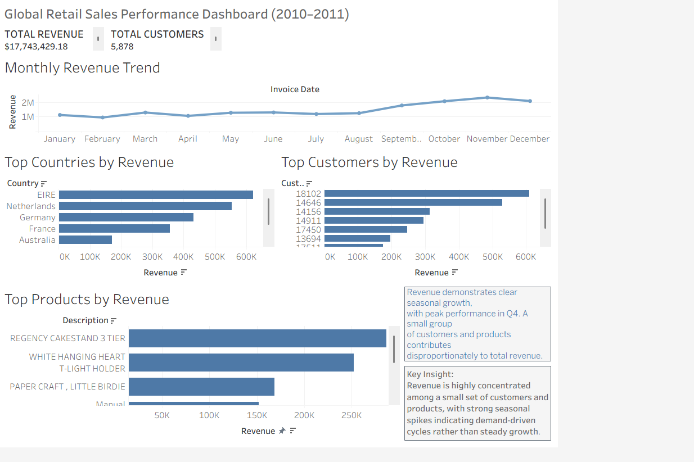

# Revenue Drivers Analysis: Customers, Products & Seasonality

## Overview
This project analyzes global retail sales data (2010–2011) to identify key revenue drivers across time, customers, and products.

## Key Insights
- Revenue is not evenly distributed — a small group of customers contributes a large share
- Product performance is highly skewed, with top items dominating sales
- Strong seasonal trend with peak demand in Q4

## Tools Used
- Tableau
- SQL (basic data exploration)
- Excel (data cleaning)

## Dashboard

## Project Structure
- data/ → raw dataset  
- dashboard/ → Tableau dashboard screenshot  
- images/ → presentation slides  

## What I Learned
This project reinforced the importance of focusing on high-impact areas instead of treating all data equally. Identifying revenue concentration helps in making better business decisions.
